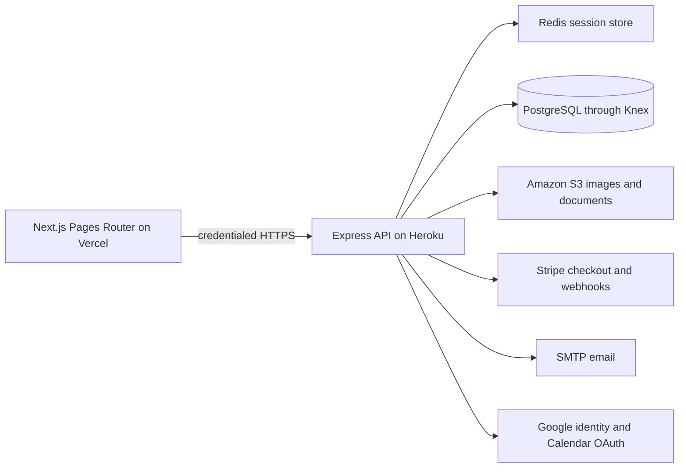

# Alpine Groove Guide Production Readiness Audit

Date: 2026-07-22

## Executive summary

The application has a solid product surface, but the audit found several production-critical authorization, privacy, upload, hydration, and data-isolation problems. The local working tree now contains targeted fixes and tests for those problems. No production data was changed and nothing was deployed.

The local frontend type-check, lint, production build, SEO regression suite, backend test suite, and production dependency audits pass. Production still runs the previous code and continues to show the observed hydration errors until the reviewed changes are committed and deployed.

## Architecture map

- Frontend: Next.js 15, React 18, TypeScript strict mode, Tailwind, FullCalendar.
- Backend: Express 4, Passport, Knex, PostgreSQL, Redis-backed sessions.
- Profiles: artist, venue, promoter, and shell records share the `artists` table and use `profile_type`.
- Events: approved public feed plus submitter, profile ownership, venue, import, claim, and duplicate metadata.
- Admin: event/profile/claim moderation, staged imports, bulk review, venue maintenance, and data quality.
- Deployments: Vercel frontend and Heroku API. Database migrations are manual; the Procfile has no release migration step.

## Critical findings addressed locally

1. Stripe checkout and billing portal accepted a browser-supplied user ID. They now require authentication and derive identity from the session.
2. Draft events and owner/reviewer data could escape public event responses. Public feeds are approved-only and responses are allowlisted by viewer permissions.
3. Event and profile upload endpoints had weak file and ownership checks. Uploads now require authorization, enforce type/size/count limits, use safe S3 keys, and avoid deleting an old image until the database accepts its replacement.
4. Multi-profile accounts could show one profile's owner-linked events on every profile. Legacy owner fallback is now restricted to a single active artist profile; venues use exact normalized matching rather than broad substring matching.
5. Public/admin user responses could include password hashes, reset tokens, unsubscribe tokens, and billing IDs. Browser-facing user objects are now explicitly allowlisted.
6. A hard-coded email address granted admin during authentication. That bypass was removed.
7. Production emitted React hydration failures on the homepage. Server and first-client state are now deterministic; browser preferences restore after hydration.

## High findings addressed locally

- Password reset now resists account enumeration and login/register/reset/inquiry endpoints are rate limited.
- Google identity login rejects unverified Google email identities; Calendar authorization remains separate.
- Event submission ignores browser-supplied owner IDs.
- Webhook failures return a retryable status; tip insertion is transactionally idempotent.
- All backend models now share one configured Knex pool instead of creating independent pools.
- Public feeds accept bounded date/region/limit queries and the first-party pages use them.
- A migration adds approved-feed, region, venue schedule, and artist schedule indexes.
- Deleted default social image references now use an existing branded fallback asset.
- Backend health/readiness endpoints and graceful shutdown were added.
- GitHub Actions CI, Dependabot, Node 24 declarations, and environment variable examples were added.
- Production dependencies were upgraded and audited to zero known production vulnerabilities.
- Browser helper modules were moved out of `pages/api`, preventing accidental Next.js API route generation.

## Remaining high risks

1. These fixes are not deployed. Production retains the old behavior until a controlled backend and frontend release.
2. The Google OAuth client secret was shown during setup. Rotate it before broad public rollout, then update the production secret without committing it.
3. There is no browser-level automated test suite for login, registration, profile creation, event submission, approval, claiming, import, and bulk moderation. Builds and unit tests cannot catch every cross-service regression.
4. Database backup retention and restore testing were not verifiable from the repository. Confirm Heroku Postgres backups and perform a restore drill in a non-production database.
5. No centralized exception monitoring or alert routing is configured in code.

## Medium risks and technical debt

- Rate limiting is in memory and therefore resets on deploy and is per dyno. Move it to Redis before horizontal scaling.
- Newsletter and transactional email delivery is synchronous and has no durable outbox/job queue. A mid-batch failure can require manual reconciliation.
- Database migrations are manual. This avoids surprise production changes but requires a written release checklist.
- The shared `artists` table is workable but increasingly couples artist, venue, promoter, and shell behavior. Keep role-specific validation in policy helpers and consider separate detail tables later, not a rewrite now.
- Content Security Policy is disabled because the current UI uses inline scripts/styles and third-party assets. Introduce CSP in report-only mode before enforcement.
- Some large admin/profile pages are still broad components. Split them only when touching a specific workflow.
- The frontend has no local deterministic SEO test fixture; the current SEO regression script checks the live site.
- Browserslist data is stale and `next lint` is deprecated. Schedule the ESLint CLI migration separately.

## Verification results

- Backend test suite: pass (22 scripts, including authorization, profiles, uploads, rate limiting, origin guard, Stripe, duplicates, parser, Calendar import, image fallback, matching, data quality, and mail templates).
- Frontend TypeScript: pass.
- Frontend ESLint: pass with zero warnings/errors.
- Frontend production build: pass, 33 routes.
- SEO regression against production: pass.
- Production dependency audit: zero known vulnerabilities in both repositories.
- Public smoke checks: homepage, weekly guide, regional page, directory, login, register, robots, sitemap, API root, and event feed all returned HTTP 200.
- Browser check: current production still emits React hydration errors; the local production build does not emit hydration errors. Its only local browser failures were expected because local `.env.local` points to an API that was not running.
- Secret-pattern scan: no matching tracked credentials found.

## Controlled release checklist

1. Review the frontend and backend diffs separately. Preserve intentional asset deletions and unrelated local work.
2. Rotate the exposed Google OAuth client secret and update Heroku configuration.
3. Confirm a fresh Heroku Postgres backup and current Redis/S3 configuration.
4. Commit the backend dependency cleanup separately; `node_modules` was previously tracked and is now removed from Git while remaining locally installed.
5. Run `npm ci && npm test` on the backend under Node 24.
6. Run `npm ci && npm run lint && npm run typecheck && npm run build` on the frontend under Node 24.
7. Run the new event-feed index migration during a quiet window.
8. Deploy the backend first. Verify `/health`, `/ready`, auth status, event feed bounds, and Stripe webhook delivery.
9. Deploy the frontend. Verify homepage console, login/password reset/Google login, register, profile switch/create, event submit/edit/delete, claim request, admin approval, import/bulk review, images, embeds, weekly guide, sitemap, and robots.
10. Watch errors, database connections, Redis, email, and Stripe for at least 30 minutes. Keep the previous releases available for rollback.

## Sustainable maintenance routine

Weekly (20-30 minutes):

- Review uptime/errors, failed Stripe webhooks, failed email, data-quality queue, and broken image reports.
- Review Dependabot PRs; merge only after CI passes.
- Approve/reject pending events, profiles, claims, and imports.

Monthly (45-60 minutes):

- Run both production dependency audits and full test/build checks.
- Verify a recent database backup and inspect storage/connection growth.
- Test one complete account -> profile -> event -> approval journey with a non-admin test account.
- Review Google OAuth, Stripe, SMTP, S3, Redis, and Heroku/Vercel service notices.

Quarterly:

- Restore a database backup into a non-production environment.
- Review admin accounts, OAuth clients, API keys, and stale user sessions.
- Revisit the slowest endpoints and the top recurring errors before adding large features.

## Recommended monitoring

- Ping `/health` and `/ready` every minute from an external uptime service; alert after two failures.
- Add Sentry (or equivalent) to both Next.js and Express with release/version tags and PII scrubbing.
- Add a Heroku log drain with alerts for 5xx bursts, Redis/DB connection failures, unhandled rejections, and graceful-shutdown timeouts.
- Alert on Stripe webhook failures and SMTP bounce/failure rates.
- Add a daily synthetic public check for homepage events, one event page, one profile page, robots, and sitemap.
- Add a weekly authenticated synthetic check in staging for login, submit, claim, and admin review rather than using production data.
